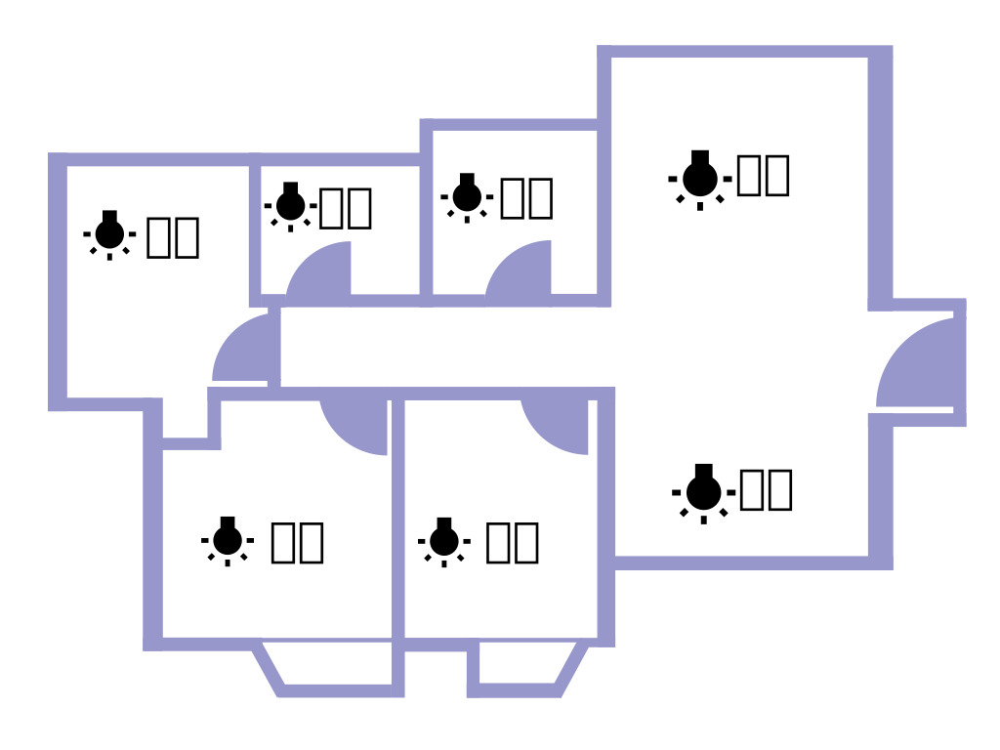
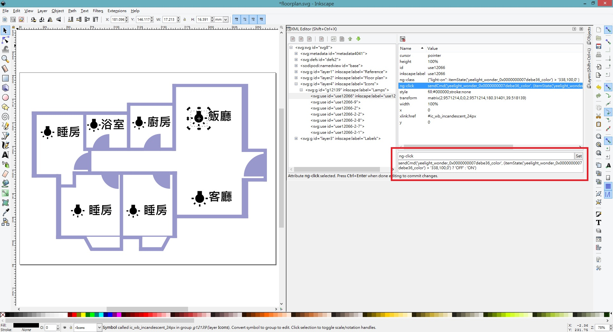
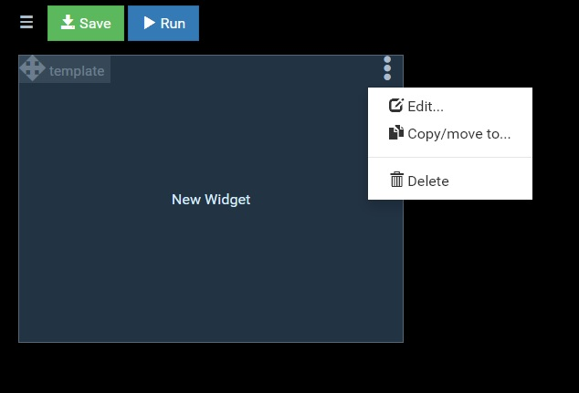

# Raspberry Pi 安裝 openHABian + Floor Plan

### 本篇記錄使用 Raspberry Pi 安裝 openHABian, 連接 小米 Yeelight, 並參考 [討論區的教學 [1]](https://community.openhab.org/t/design-your-svg-floorplan-or-dashboard-for-habpanel-with-inkscape/38441) 設置 Floor Plan.

openHAB 支持 Windows, Mac, Linux, NAS 及其他系統, 可以根據需求選擇. 因為手上有一塊 Raspberry 2B, 所以用它進行測試, 除了開關機需要一些時間外(可能是因為 openHAB 是使用 Java 關係), 都沒其他問題.

## 速度測試 (Raspberry Pi 2B):
- 開機約 2 分鐘
- Reboot 約 3 分鐘
- 關機約 1 分鐘

## 用到的軟件/硬件:
1. Raspberry Pi 2
2. SD Card (最少 8GB, 如果用到其他服務, 建議使用 16 GB 或 32 GB)
3. 小米 Yeelight
4. Yeelight App (App Store 或 Play Store 下載)
5. [openHAB](https://www.openhab.org/) (https://www.openhab.org/)
6. [Etcher](https://etcher.io/) (https://etcher.io/)
7. [InkScape](https://inkscape.org/) (https://inkscape.org/)
8. [Putty](https://www.chiark.greenend.org.uk/~sgtatham/putty/) (https://www.chiark.greenend.org.uk/~sgtatham/putty/)

## 安裝:
很簡單, 跟著[官網](https://www.openhab.org/docs/installation/openhabian.html) (https://www.openhab.org/docs/installation/openhabian.html) [2] 做就可以, 
1. 下載 Raspberry Pi 適用的 image (https://www.openhab.org/download/), 版本為 Stable 2.4.0
2. 下載 [Etcher](https://etcher.io/) (https://etcher.io/)
3. 使用 Etcher 將 image (.img.xz) 寫入 SD card
4. 把 SD card 放入 Raspberry Pi, 接上網線, 開啓電源
5. 第一次開機需時 15-45 分鐘 (用 Raspberty Pi 2B 測試, 約 45 分鐘)

## 開始使用前(一):
1. 在手機 Yeelight App 設定好 Yeelight 連接上 Wi-Fi

## 開始使用前(二):
因為預設的時區和鍵盤配置有點不一樣, 所以手動改一下.
1. 登入 shell, 預設帳號 `openhabian:openhabian`
2. 輸入 `sudo openhabian-config` 更改時區
3. 輸入 `sudo raspi-config` 更改鍵盤設定, 在 Change Keyboard Layout 選 Generic 105-key (Intel) PC, 鍵盤配置選 English (US), No AltGr key, No compose key. 參考 [Raspberry Pi 更改鍵盤設定](http://blogger.gtwang.org/2014/12/raspberry-pi-keyboard-config.html) (http://blogger.gtwang.org/2014/12/raspberry-pi-keyboard-config.html) [3]
4. 輸入 reboot 重啓

## 第一次使用
1. 打開 openHAB 2 dashboard: http://openhabianpi:8080 , 預設有 avahi-daemon 服務, 如果是手動安裝, 再改為對應 ip
2. 強力建議選用 **Standard RECOMMENDED SETUP** 
3. 等候 2-3 分鐘左右, 讓它安裝之後要用到的 UI 介面 
4. 先記下/bookmark 這個 url, 之後會再回來. 我們會用到 PAPER UI 和 HABPANEL, 在 PAPER UI 裏可做設定和控制, 而 HABPANEL 可以自訂介面和供 tablet 使用, 今次的 floor plan 也是要用到 HABPANEL 的功能的
5. 先進入 [PaperUI](http://openhabianpi:8080/paperui/index.html), 到左面 menu 選 Configuration > System, 在 Item Linking 開啓 "**Simple Mode**" 再按 "**儲存**", 做了這一步, 以後加添設備時會**方便很多**

## 加入 Yeelight
1. 到左面 menu 的 Add-ons, 選 Bindings, 它支持很多牌子, 拉到最低下找到 Yeelight Binding
2. 安裝前, 按 "Yeelight Binding" 字樣看[說明](https://www.openhab.org/addons/bindings/yeelight/) [4], 這時候要在手機的 Yeelight App 把 Lan Control 打開才可以在讓 openHAB 看到它
3. 打開 Lan Control 後, 返回 openHAB, 按 **"Install"**, 等待安裝
4. 到左面 menu 的 Inbox, 按 "+", 選 Yeelight Binding 尋找
5. 找到後, 按 ✓ 加入, 改個有意思的名字, 如果有多個設備, 可以輸入 Location 欗位作分頪
6. 成功加入後, 可以在痘面 menu 的 Control 頁看到, 先試一試改變光暗顏色, 確定有連接成功

**P.S.: 這有一個問題: 它沒有顯示開/關狀態. 使用 [Xiaomi Mi IO Binding](https://www.openhab.org/addons/bindings/miio/) [5] 好像能夠偵測, 要在手機拿到它的 mio2db 找 token. 不知是 Yeelight 還是 openHAB 的設計. 現在先用簡單的方法, 測試 floor plan 是否可行.**

## 建立 Floor Plan 平面圖 CSS 及 SVG
1. 建立一個 floorplan.css, 輸入:
```css
    .light-on {
        fill: #ffe600 !important;
    }
```
2. 使用 Inkscape 畫好一個平面圖, 放入幾個 💡 
2. 打開 XML Editor (Ctrl-Shift-X)
3. 再選定其中一個 💡
4. 在 XML Editor 加入 3 個 attributes, 每輸入一個 attribute 要按一下 "set":
<table>
<thead>
<tr><th>Name</th><th>Value</th></tr>
</thead>
<tbody>
<tr><td>cursor</td><td>pointer</td></tr>
<tr><td nowrap>ng-class</td><td>{"light-on": itemState('Your_Item_Name') == 'Your_Item_Value' }</td></tr>
<tr><td nowrap>ng-click</td><td>sendCmd('Your_Item_Name', (itemState('Your_Item_Name') == 'Your_Item_Value') ? 'OFF' : 'ON')</td></tr>
</tbody>
</table>

**有關如何找出 Your_Item_Name 和 Your_Item_Value, 在後面的部份再詳細說明**

以我的 case 為例, Your_Item_Name 是 'yeelight_wonder_0x0000000007debe36_color', Your_Item_Value 是 '338,100,0'  
<table>
<thead>
<tr><th>Name</th><th>Value</th><th>說明</th></tr>
</thead>
<tbody>
<tr><td nowrap>ng-class</td><td>{"light-on": itemState('yeelight_wonder_0x0000000007debe36_color') == '338,100,0' }</td><td nowrap>itemState = value('338,100,0') 時, 加入 floorplan.css 中的 light-on 樣式</td></tr>
<tr><td>ng-click</td><td>sendCmd('yeelight_wonder_0x0000000007debe36_color', (itemState('yeelight_wonder_0x0000000007debe36_color') == '338,100,0') ? 'OFF' : 'ON')</td><td>mouse-click 時, 使用 sendCmd API 送出 'OFF' 或 'ON' 指令</td></tr>
</tbody>
</table>

__* 前面提到 Yeelight addon 查不到 💡 的 On/Off 狀態, 所以用 color 的值做比較.__

6. 儲存為 floorplan.svg
7. openHABian 預設有 samba, 經網路芳鄰進入 `\\OPENHABIANPI\openHAB-conf`, 預設帳號 `openhabian:openhabian`
8. 把 floorplan.css 和 floorplan.svg 放入 `\\OPENHABIANPI\openHAB-conf\html`

## 放入 Floor Plan 平面圖
進入下一步之前, 先瞭解一下怎樣操作 HABPANEL, 這篇 [OpenHab Dashboard using HABPanel - The Ultimate Guide](https://www.smarthomeblog.net/openhab-dashboard/) [5] 有詳細說明, code 部份比較進階可以不看
1. 返回 openHAB 2 dashboard: http://openhabianpi:8080 進入 HABPANEL
2. 建立一個空白 dashboard, 進入修改模式, 在右上角 Add Widget 選 Template
3. 再按那個 template widget, 的右上的 menu 進入修改 
4. 輸入
```html
<div oc-lazy-load="'../static/floorplan.css'">
	<div ng-include="'../static/floorplan.svg'"></div>
</div>
```
5. 按 Save
6. 調整好 widget 大小, 按左上角 Save 和 Run
7. 進行測試和 debug
8. 再看 [OpenHab Dashboard using HABPanel - The Ultimate Guide](https://www.smarthomeblog.net/openhab-dashboard/) [6] 在的 Save your OpenHab Dashboard 部份, 在 Settings 下選 "**Save the current configuration to a new plane configuration**", 輸入一個名字並記下 (如: Home)
9. 再返回 PaperUI, 進入 Configuration > Services > UI, 按 HABPanel 的 CONFIGURE, 在 Initial panel configuration 下輸入記下的名字 (如: Home), 按 SAVE. **這個動作讓其他電腦或 tablet 進入 HABPanel 時不會見到一片空白**

## 找出 Your_Item_Name 和 Your_Item_Value
1. SSH 入 Raspberry Pi 後, 
2. 再 `ssh -p 8101 openhab@localhost` 打開 openHAB console (https://www.openhab.org/docs/administration/console.html) [7]
3. 密碼: `habopen`
4. 輸入	`smarthome:items list` [8] 找出已加入的 yeelight, 即是 Your_Item_Name
5. 輸入 `smarthome:status <item>` [8], 如 `smarthome:status yeelight_wonder_0x0000000007debe36_color` 找到 Your_Item_Value

## 網外
可用 openHAB 的 Cloud service, 或使用 Nginx Reverse Proxy 方式 (看 Running openHAB Behind a Reverse Proxy 部份)
https://www.openhab.org/docs/installation/security.html [9]

## FAQ
 1. Q. Floorplan SVG not working <br/>
	A. 用 Inkscape 後, 打開 XML editor, 找到 “metadata” 把它刪除

## 結論
應該算是一個成功了一半 :

成功的是: 證明了可以使用 Floor Plan 送出控制指令, 想要自訂 UI 或喜歡折騰的人可以嘗試一下.

失敗的是: 
1. 因為這次不是測試改變顏色, 而是做一個單純的開關. 想要直接找出 Yeelight 的 On/Off 狀態, 似乎還要再研究一下; 
2. 或者用不同設備/牌子又會得出另一種結果.

就是選擇設備前, 多做功課, 確定軟件/硬件兩方面能夠配合和滿足要求再作決定.

## Reference: 
1. https://community.openhab.org/t/design-your-svg-floorplan-or-dashboard-for-habpanel-with-inkscape/38441
2. https://www.openhab.org/docs/installation/openhabian.html#raspberry-pi
3. http://blogger.gtwang.org/2014/12/raspberry-pi-keyboard-config.html
4. https://www.openhab.org/addons/bindings/yeelight/
5. https://www.openhab.org/addons/bindings/miio/
6. https://www.smarthomeblog.net/openhab-dashboard/
7. https://www.openhab.org/docs/administration/console.html
8. https://www.openhab.org/docs/administration/runtime.html
9. https://www.openhab.org/docs/installation/security.html#running-openhab-behind-a-reverse-proxy
